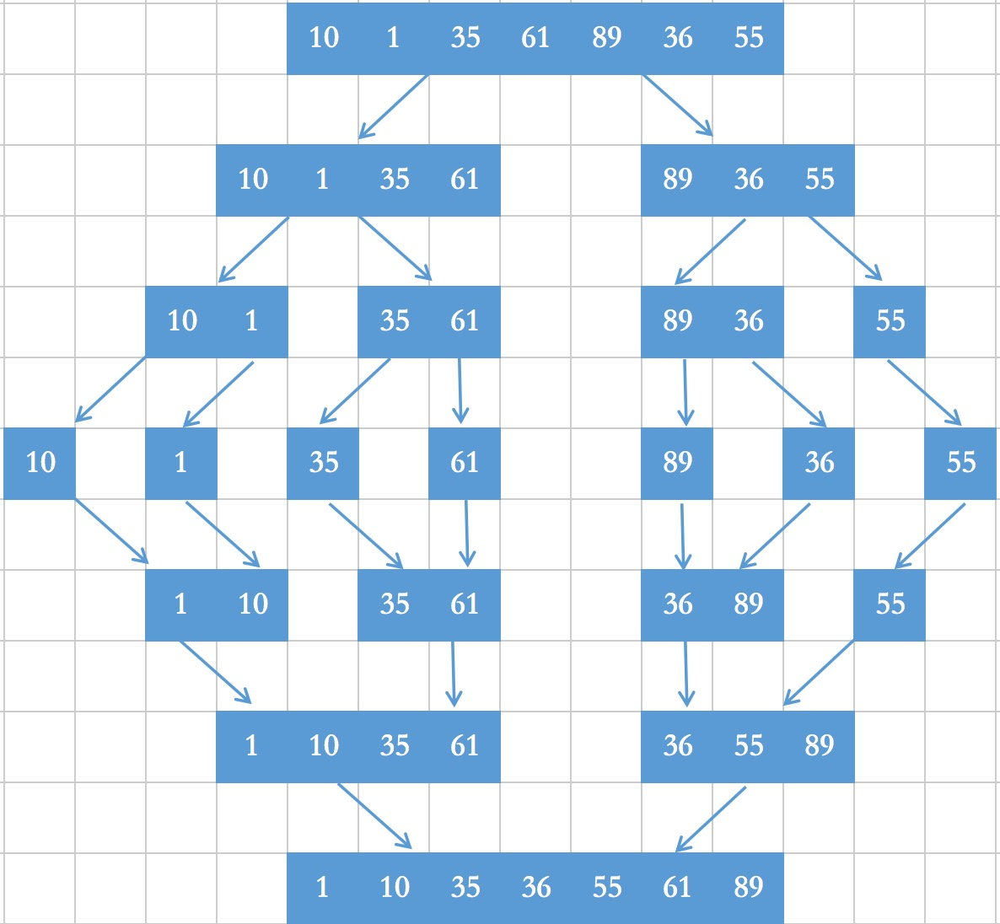

## 归并排序（Merge sort）

归并排序（Merge sort）是建立在归并操作上的一种有效的排序算法,该算法是采用分治法（Divide and Conquer）的一个非常典型的应用。将已有序的子序列合并，得到完全有序的序列；即先使每个子序列有序，再使子序列段间有序。若将两个有序表合并成一个有序表，称为二路[归并](https://baike.baidu.com/item/%E5%BD%92%E5%B9%B6/253741)。

### 算法原理

从归并排序的定义来看，其主要是归并操作，而归并操作的前提是两个已经排序的序列，所以首先需要将一个序列划分一个个有序的的序列，然后再进行归并。
**它的核心思想是：先分后归（先拆分为一个个有序的子序列，再将一个个有序子序列进行归并操作最后合并为一个有序的序列）**




​		     第一次分解：将主序列分解成2个序列 　　 　    		[1,10,35,61]     [89,36,55]

　　　　　　第二次分解：将2个序列分解成4个序列 　　	  	    [1,10]  [ 35,61]  [89,36] [55]

　　　　　　第三次分解：将4个序列分解成7个序列 　			    [1] [10] [35] [61]  [89] [36] [55]

　　　　　　第四次合并：将7个序列合成成4个序列，合并时排序	   [1,10] [35,61]  [36, 89 ] [55]

 　　　　　  第五趟排序：将4个序列合成成2个序列，合并时排序序　　　 [1,10, 35,61]  [36, 55,89 ]

　　　　　　第六趟排序：将2个序列合成成1个序列，合并时排序　　	[1,10,35,36,55,61,89]

　　　　　　第一趟总共进行了六次比较，排序结果： [1,10,35,36,55,61,89]

```python
def merge_sort(lists):
    if len(lists) <= 1:
        return lists
    num = int( len(lists) / 2 )
    left = MergeSort(lists[:num])
    right = MergeSort(lists[num:])
    return Merge(left, right)
def merge(left,right):
    r, l=0, 0
    result=[]
    while l<len(left) and r<len(right):
        if left[l] <= right[r]:
            result.append(left[l])
            l += 1
        else:
            result.append(right[r])
            r += 1
    result += list(left[l:])
    result += list(right[r:])
    return result
```

